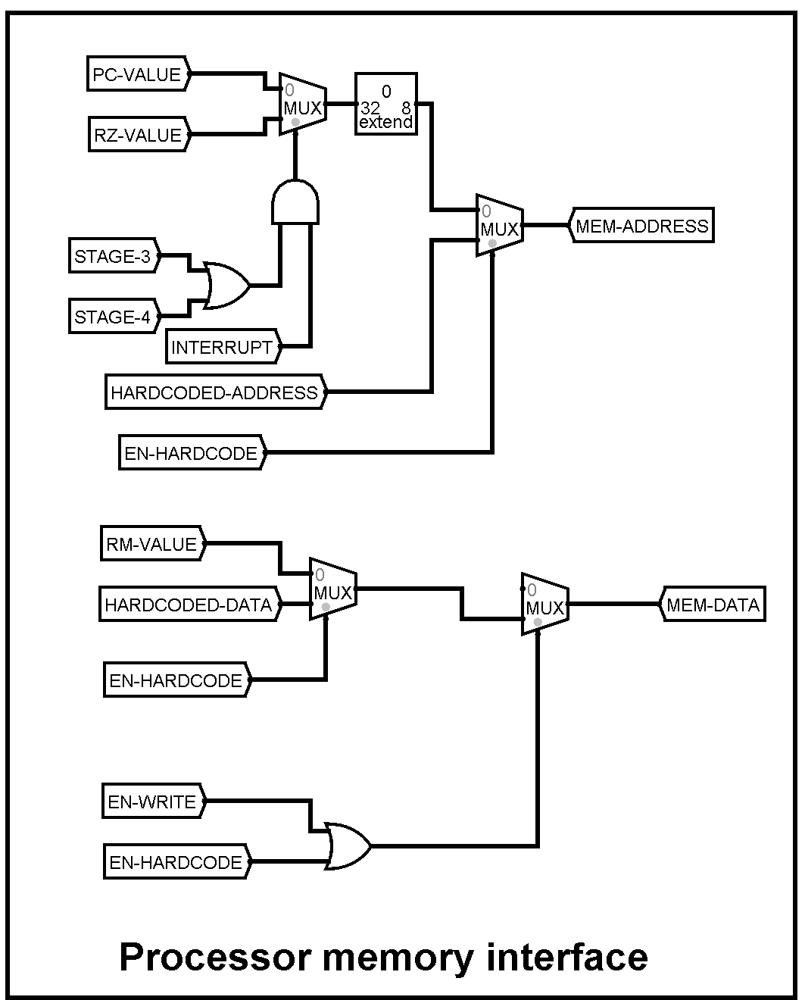

<h1 align="center">32 - bit RISC Processor Design </h1>

<h3 align="center"> Computer Organization and Architecture Laboratory Mini-Project </h3>

## Team Members:
Ayush Vinayak Asutkar 
Raghav Gade  

## Problem Statement
Designing a 32-bit RISC processor that will support the following assembly instruction:
- MOVE Ri, Rj: The content of Rj is transferred to Ri.
- MOVE Ri, Immediate (16 – bit): The immediate value (32 – bit unsigned extended) will be transferred to Ri.
- LOAD Ri, X(Rj): The content of memory location [ [ Rj ] + X ] is loaded into Ri, where X is a 16-bit unsigned immediate value.
- STORE Ri, X(Rj): The content of register Ri is stored in memory [ [ Rj ] + X ], where X is a 16 – bit unsigned immediate value.
- ADD Ri, Rj, Rk: Ri = Rj + Rk
- ADI Ri, Rj, Immediate (16 – bit): Ri = Rj + Immediate value (32 – bit unsigned extended)
- SUB Ri, Rj, Rk: Ri = Rj – Rk
- SUI Ri, Rj, Immediate (16 – bit): Ri = Rj – Immediate value (32 – bit unsigned extended)
- AND Ri, Rj, Rk: Ri = Rj AND Rk
- ANI Ri, Rj, Immediate (16 – bit): Ri = Rj AND Immediate value (32 – bit unsigned extended)
- OR Ri, Rj, Rk: Ri = Rj OR Rk
- ORI Ri, Rj, Immediate (16 – bit): Ri = Rj OR Immediate value (32 – bit unsigned extended)
- HLT: Stops the execution

## Instruction Encoding:

### Instruction Format

**32 – bit instruction and supports 16 – bit immediate value**

**Encoding: -** OOOO YYYY AAAA BBBB XXXXXXXXXXXXXXXX

**Encoding in Hexadecimal: -** O Y A B XXXX

| **Component** | **Binary** | **Hexadecimal**|
| :--- | :--- | :-- |
| Opcode | OOOO | O |
| Destination | YYYY | Y |
| Source - 1 | AAAA | A |
| Source - 2 | BBBB | B |
| Immediate | XXXXXXXXXXXXXXXX | XXXX |

### Opcode for Instructions

| Instruction | Opcode | Hexadecimal Opcode |
|:-----------------------------:|:------------------------------:|:------------------------------:|
|     MOV Ri, Rj         |     0000      |     0                     |
|     MVI Ri, X          |     0001      |     1                     |
|     LOAD Ri, X(Rj)     |     0010      |     2                     |
|     STORE Rk, X(Rj)    |     0011      |     3                     |
|     ADD Ri, Rj, Rk     |     0100      |     4                     |
|     ADI Ri, Rj X       |     0101      |     5                     |
|     SUB Ri, Rj, Rk     |     0110      |     6                     |
|     SUI Ri, Rj, X      |     0111      |     7                     |
|     AND Ri, Rj, Rk     |     1000      |     8                     |
|     ANI Ri, Rk, X      |     1001      |     9                     |
|     OR Ri, Rj, Rk      |     1010      |     A                     |
|     ORI Ri, Rk, X      |     1011      |     B                     |
|     HLT                |     1100      |     C                     |

### Encoding for Registers

**4 bits are used for 8 registers**

| **Register** | **Binary    Encoding** | **Hexadecimal   Encoding** |
|:-------------------:|:--------------------------:|:-------------------------------:|
|          R0         |             0000           |                 0               |
|          R1         |             0001           |                 1               |
|          R2         |             0010           |                 2               |
|          R3         |             0011           |                 3               |
|          R4         |             0100           |                 4               |
|          R5         |             0101           |                 5               |
|          R6         |             0110           |                 6               |
|          R7         |             0111           |                 7               |

### Examples

- **ADD R1, R2, R2: 41220000**  
No immediate value in this case, keeping it 0 is preferable. Similar encoding needs to be followed in case of **SUB**, **AND** and **OR** instructions with respective opcodes.

    | **Opcode** | **Destination** | **Source – 1** | **Source – 2** | **Immediate** |
    | :-----------: | :-----------: | :-----------: | :-----------: | :-----------------------:|
    | 0100 | 0001 | 0010 | 0010 | 0000000000000000 |
    | 4 | 1 | 2 | 2 | 0000 |

- **SUI R1, R2, 300: 7120012C**  
No Source - 2 value in this case, keep the value of Source - 2 as 0. Similar encoding needs to be followed in case of **ANI**, **ADI** and **ORI** instructions with respective opcodes.

    | **Opcode** | **Destination** | **Source – 1** | **Source – 2** | **Immediate** |
    | :-----------: | :-----------: | :-----------: | :-----------: | :-----------------------:|
    | 0111 | 0001 | 0010 | 0000 | 0000000100101100 |
    | 7 | 1 | 2 | 0 | 012C |

- **LOAD R1, 12(R2): 2120000C**  
No Source - 2 value in this case, keep the value of Source - 2 as 0.

    | **Opcode** | **Destination** | **Source – 1** | **Source – 2** | **Immediate** |
    | :-----------: | :-----------: | :-----------: | :-----------: | :-----------------------:|
    | 0010 | 0001 | 0010 | 0000 | 0000000000001100 |
    | 2 | 1 | 2 | 0 | 000C |

- **STORE R3, 22(R4): 304300016**  
No Destination value in this case, keep the value of Source - 2 as 3, because R3 contains the data. Effective address will be = [R4] + 22.

    | **Opcode** | **Destination** | **Source – 1** | **Source – 2** | **Immediate** |
    | :-----------: | :-----------: | :-----------: | :-----------: | :-----------------------:|
    | 0011 | 0000 | 0100 | 0011 | 0000000000101100 |
    | 3 | 0 | 4 | 3 | 0016 |

- **MOV R2, R6: 02600000**  
No Source - 2 and Immediate value in this case, keep this value as 0.

    | **Opcode** | **Destination** | **Source – 1** | **Source – 2** | **Immediate** |
    | :-----------: | :-----------: | :-----------: | :-----------: | :-----------------------:|
    | 0000 | 0010 | 0110 | 0000 | 0000000000000000 |
    | 0 | 2 | 6 | 0 | 0000 |

- **MVI R3, 420: 130001A4**  
No Source - 1 and Source 2 in this case, keep this values as 0.

    | **Opcode** | **Destination** | **Source – 1** | **Source – 2** | **Immediate** |
    | :-----------: | :-----------: | :-----------: | :-----------: | :-----------------------:|
    | 0001 | 0011 | 0000 | 0000 | 0000000110100100 |
    | 1 | 3 | 0 | 0 | 01A4 |

- **HLT: C0000000**  
No Source - 1 and Source 2 in this case, keep this values as 0.

    | **Opcode** | **Destination** | **Source – 1** | **Source – 2** | **Immediate** |
    | :-----------: | :-----------: | :-----------: | :-----------: | :-----------------------:|
    | 0110 | 0000 | 0000 | 0000 | 0000000000000000 |
    | C | 0 | 0 | 0 | 0000 |

## Overall Architecture

| **Components** | **Description** |
|:-----------------------------------------:|:----------------------------------------------------:|
| General Purpose Registers   (GPRs) | 8: R0 – R7 |
| Special Purpose Registers (SPRs) | 7: PC, IR, RA, RB, RZ, RM, RY |
| Memory | RAM: 8 – bit Address Line and 32 – bit Data |
| Instruction Supported | 13 |

## Components

### 1. Processor Pipeline – 5 stage pipeline

### 2. Fetch Unit

### 3. Memory Unit

### 4. Processor Memory Interface

### 5. Instruction Register – internal circuit

### 6. Control Unit

### 7. Register File

### 8. ALU

### 9. Stage Counter

## Usage Instructions
1. Clone this repository using `https://github.com/Ayush-Asutkar/32-bit-CPU-Designing.git` or downloading the zip-file.
1. Convert the Assembly Code to Machine Code using the encoding format given in the file “Encoding Scheme.pdf” or as mentioned above.
1. Open the “miniCPU.circ” file in Logisim.
1. Click on the clear buttons as required. If using for the first time, click on all the buttons in that section. It will clear any previous data in the processor.
1. Input the machine code instruction into the memory unit present in the main file. Make sure that the program starts from address 00 and it ends with a HLT instruction, otherwise the program would stop execution. This step can also be done using hardcoded inputs, as mentioned below. 
1. Feed the data into the register file, if required, by using hardcoded inputs.
1. Enable the ticks in Logisim to run the machine program. The program finished execution once it receives the HLT instruction.

### For hardcoded inputs:
This is function is built-in for effective memory writing without having to manipulate components and effectiveness. 
This functionality is implemented for Register File and Memory as they are hard to overwrite. 
Note that this functionality is to be used when the processor is not at any stage or it will abnormally manipulate some values in Memory and Register File. 

For usage of this functionality it is advised to always turn on EN-HARDCODE. 
After doing that move to the hardcode section. 
Enable the EN-HARDCODE. 
After this, either we change memory or register files-
1) Enter the memory or register file address
2) Enter the values desired.
3) Then trigger memory or register triggers respectively for your choice of operation.
4) Turn off the enable.
